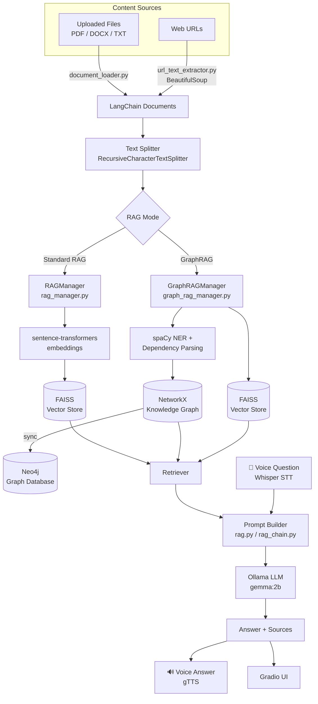
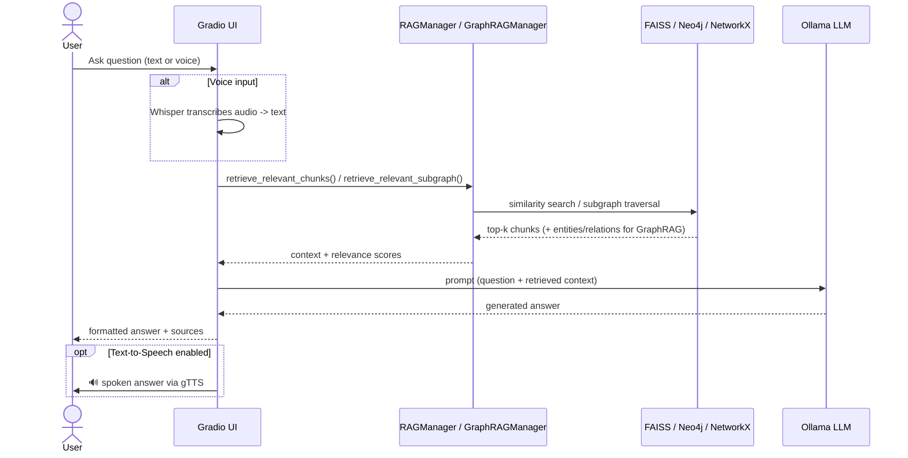

# DocuNex

Local-first Retrieval-Augmented Generation (RAG) system for chatting with your documents and URLs — with an optional **Knowledge Graph mode** (GraphRAG + Neo4j) and **voice input/output** (Whisper + gTTS). Runs entirely on local models via [Ollama](https://ollama.com), so no OpenAI/Anthropic API key is required.

[](https://github.com/Kahaan19/DocuNex/actions/workflows/ci.yml)


## Table of Contents

- [Overview](#overview)
- [Demo](#demo)
- [Features](#features)
- [Architecture](#architecture)
- [How a Query Is Answered](#how-a-query-is-answered)
- [Tech Stack](#tech-stack)
- [Project Structure](#project-structure)
- [Getting Started](#getting-started)
- [Usage](#usage)
- [Configuration](#configuration)
- [Testing](#testing)
- [Roadmap](#roadmap)
- [Known Issues](#known-issues)
- [Author](#author)

## Overview

DocuNex lets you build a private knowledge base from **PDFs, DOCX, TXT files, or web URLs**, then ask natural-language questions about that content. It supports two retrieval strategies:

- **Standard RAG** — chunks documents, embeds them with `sentence-transformers`, and retrieves the most relevant chunks via **FAISS** similarity search.
- **GraphRAG** — additionally extracts named entities and relationships (via spaCy) into a **NetworkX** knowledge graph, optionally persisted to **Neo4j** for visualization/querying, and retrieves both relevant chunks *and* relevant subgraphs.

All answer generation runs through a local **Ollama** model, so the whole pipeline can run offline on your own machine/GPU.

**Engineering highlights:**

- Pluggable retrieval — Standard RAG and GraphRAG share one Gradio front end and swap behind a single `rag_type` switch.
- Hybrid GraphRAG retrieval — combines semantic chunk search with knowledge-graph subgraph traversal, then degrades gracefully to vector search when the graph yields nothing.
- Runtime-adaptive compute — auto-detects CUDA vs. CPU and sizes embedding batches accordingly.
- Fault-tolerant integrations — the app stays usable when Neo4j, Ollama, or the GPU is unavailable, surfacing status instead of crashing.

## Demo

> **📸 Add a screenshot or GIF here.** Recruiters skim visually — a short clip of building a knowledge base and asking a question is the highest-impact thing you can add to this README.
>
> Suggested captures:
> 1. The **Upload & Build** tab ingesting a PDF/URL.
> 2. The **Ask Questions** tab streaming a grounded answer with cited sources.
> 3. (Optional) The Neo4j browser showing the generated knowledge graph.
>
> Save images to a `docs/` or `assets/` folder and embed them, e.g.:
>
> ```markdown
> 
> ```

## Features

- 📄 **Multi-source ingestion** — PDF, DOCX, TXT files and arbitrary web URLs (`document_loader.py`, `url_text_extractor.py`)
- 🧠 **Two RAG modes** — switchable Standard RAG (FAISS) or GraphRAG (knowledge graph + FAISS fallback)
- 🕸️ **Knowledge graph construction** — entity/relationship extraction with spaCy, stored in NetworkX and optionally synced to Neo4j (`graph_rag_manager.py`)
- ⚡ **GPU-aware embeddings** — auto-detects CUDA and falls back to CPU for `sentence-transformers` encoding
- 🎤 **Voice interface** — speech-to-text via OpenAI Whisper and text-to-speech via gTTS (`SpeechToTextUsingWhisper.py`)
- 🖥️ **Gradio web UI** — upload documents/URLs, ask questions via text or voice, inspect live system status
- 🔌 **Local LLM inference** — answers generated by Ollama models (no external API key needed)
- 📊 **Live diagnostics** — in-app status tab reports Ollama/Neo4j connectivity, graph stats, and vector store stats

## Architecture



## How a Query Is Answered



## Tech Stack

| Layer | Technology |
|---|---|
| UI | [Gradio](https://gradio.app) |
| Orchestration | [LangChain](https://www.langchain.com/) |
| Embeddings | `sentence-transformers` (`all-MiniLM-L6-v2`), HuggingFace / Google Generative AI embeddings |
| Vector store | [FAISS](https://github.com/facebookresearch/faiss) |
| Knowledge graph | [NetworkX](https://networkx.org/) + [Neo4j](https://neo4j.com/) |
| NLP / entity extraction | [spaCy](https://spacy.io/) (`en_core_web_sm`) |
| LLM inference | [Ollama](https://ollama.com) (local models, e.g. `gemma:2b`) |
| Speech-to-text | [OpenAI Whisper](https://github.com/openai/whisper) |
| Text-to-speech | [gTTS](https://github.com/pndurang/gTTS) + `pygame` |
| Document parsing | `PyPDFLoader`, `Docx2txtLoader`, `TextLoader`, `BeautifulSoup4` |
| Acceleration | PyTorch (CUDA auto-detect, falls back to CPU) |

## Project Structure

```
DocuNex/
├── ContextBasedQuestionsUsingLLM.py   # Main Gradio app (RAG + GraphRAG, Neo4j sync)
├── SpeechToTextUsingWhisper.py        # Same app + voice input/output (Whisper, gTTS)
├── config.py                          # Centralized, env-driven configuration
├── ollama_utils.py                    # Shared Ollama connection + streaming helpers
├── neo4j_utils.py                     # Shared Neo4j driver, sanitizers, graph insert
├── rag_manager.py                     # RAGManager: FAISS-backed vector store lifecycle
├── graph_rag_manager.py               # GraphRAGManager: NER, knowledge graph, Neo4j export
├── rag_chain.py                       # Answer generation for GraphRAG via Ollama
├── rag.py                             # Answer generation for standard RAG via Ollama
├── document_loader.py                 # PDF / DOCX / TXT ingestion
├── url_text_extractor.py              # Web page text extraction
├── tests/                             # pytest suite for the core helpers
├── .github/workflows/ci.yml           # GitHub Actions: run tests on push / PR
├── requirements.txt                   # Runtime dependencies
├── requirements-dev.txt               # Dev/test dependencies (adds pytest)
├── .env.example                       # Neo4j connection template
└── .gitignore
```

## Getting Started

### Prerequisites

- Python 3.10+
- [Ollama](https://ollama.com) installed and running (`ollama serve`), with a model pulled, e.g.:
  ```bash
  ollama pull gemma:2b
  ```
- [Neo4j](https://neo4j.com/download/) running locally (optional — only required for GraphRAG's Neo4j sync; the app degrades gracefully without it)
- A CUDA-capable GPU (optional — the app auto-detects and falls back to CPU)

### Installation

```bash
git clone https://github.com/Kahaan19/DocuNex.git
cd DocuNex

python -m venv venv
source venv/bin/activate      # Windows: venv\Scripts\activate

pip install -r requirements.txt
python -m spacy download en_core_web_sm
```

### Configure environment

```bash
cp .env.example .env
# edit .env with your Neo4j URI/user/password if not using the defaults
```

### Run

```bash
# Text-only interface
python ContextBasedQuestionsUsingLLM.py

# Interface with voice input/output (Whisper + gTTS)
python SpeechToTextUsingWhisper.py
```

The Gradio app launches at `http://localhost:7860`.

## Usage

1. **Upload & Build** tab — provide comma-separated URLs and/or upload PDF/DOCX/TXT files, choose **RAG** or **GraphRAG**, then click **Build Knowledge Base**.
2. **Ask Questions** tab — type a question (or record voice input and transcribe it), then click **Ask Question** to get a grounded answer with cited sources.
3. **System Info / Status** — check Ollama, Neo4j, GPU, and knowledge-base connectivity/stats at any time.

## Configuration

All settings are read from the environment (via a `.env` file) in [`config.py`](config.py), with the defaults below.

| Variable | Default | Purpose |
|---|---|---|
| `NEO4J_URI` | `bolt://localhost:7687` | Neo4j connection string |
| `NEO4J_USER` | `neo4j` | Neo4j username |
| `NEO4J_PASSWORD` | `password` | Neo4j password |
| `OLLAMA_BASE_URL` | `http://localhost:11434` | Ollama API endpoint |
| `OLLAMA_MODEL` | `gemma:2b` | Ollama model used for answer generation |
| `BASE_PERSIST_DIR` | `./graph_db` | Where GraphRAG knowledge graphs are stored |
| `BASE_VECTOR_DIR` | `./vector_db` | Where RAG vector stores are stored |

## Testing

The core helpers (configuration, Ollama connection/streaming, Neo4j sanitizers) are covered by a `pytest` suite that runs without a GPU, Ollama, or Neo4j — external calls are faked, so the tests are fast and CI-friendly.

```bash
pip install -r requirements-dev.txt
pytest
```

Tests also run automatically on every push and pull request via [GitHub Actions](.github/workflows/ci.yml) across Python 3.10–3.12.

## Roadmap

- [x] Consolidate duplicated app logic into shared modules (`config.py`, `ollama_utils.py`, `neo4j_utils.py`)
- [x] Add an automated test suite and CI
- [ ] Extend test coverage to ingestion, chunking, and retrieval
- [ ] Merge the two entry points into a single app with a `--voice` flag
- [ ] Support additional LLM backends beyond Ollama
- [ ] Persist chat history per session

## Known Issues

- The two entry points (`ContextBasedQuestionsUsingLLM.py` and `SpeechToTextUsingWhisper.py`) now share their config and Ollama/Neo4j helpers, but still duplicate some Gradio UI wiring and RAG-building glue. Merging them into one app with a `--voice` flag is on the [roadmap](#roadmap).

## Author

**Kahaan Gandhi**

- GitHub: [@Kahaan19](https://github.com/Kahaan19)

If you find this project useful or interesting, consider giving it a ⭐ — it helps others discover it.
